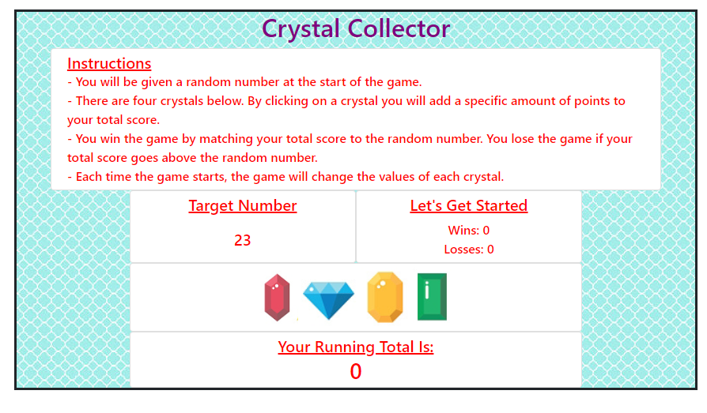

	Readme:
	Assignment 4
    jQuery - Crystal Collector
    Rhonda Johnson 

	Link to deployed project
	https://rmxjohnson.github.io/unit-4-game/
	
    This is an interactive game for web browsers.  
	A jQuery library will dynamically update the HTML page.
	Bootstrap is used to display the HTML page.
	
	Files:	
	index.html  - HTML page
	style.css - customized the display of the HTML page
	game.js - javascript file which controls the behavior of the HTML page
	4 image files for crystals - blue.png, red.png, green.png, yellow.png
	1 file for background - turquoise.jpg
	
	
	javascript / jQuery:
	Each new game will generate a random target number between 19 & 120
	Each new game will create 4 imageCrystals
	Each crystal will be assigned a value between 1 and 12
	Each crystal will be given the class ".crystal-image"
	Each imageCrystal will be given a source (src) link to the crystal image.  (An array holds a list of the image files)
	Each imageCrystal will be given a data attribute called data-crystalValue. This is a random number between 1 & 12.
	Each crystal image (with all it classes and attributes) will get added to the page.
	
	
	Synopsis of Game:
    The player will be given a random target number at the start of the game. 
    There are four crystals displayed. By clicking on a crystal the player will add a specific amount of points to their total score.
    The player wins the game by matching the player total score to the random number. 
	The player loses the game if the player total score goes above the random number.
    Each time the game starts, the game will generate a new target number and change the values of each crystal.
	
	## Home Page

		
